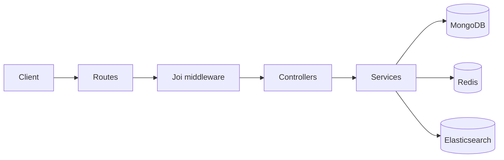

# BE-Dentist

Backend API cho hệ thống quản lý phòng khám nha khoa — đặt lịch theo slot, thanh toán, tìm kiếm, nhắc lịch và realtime.

## Tính năng nổi bật

- **Auth**: đăng ký / đăng nhập, JWT + refresh token, Google / Facebook OAuth, 2FA (QR + OTP)
- **Đặt lịch thông minh**: Slot Generation Engine (ca làm việc, nghỉ trưa, thời lượng dịch vụ, buffer), giữ chỗ Redis (TTL), thanh toán rồi confirm
- **Thanh toán**: COD, MoMo, ZaloPay, VNPay
- **Background jobs**: BullMQ / Redis — nhắc lịch 1 ngày / 2 giờ trước, thông báo đổi lịch
- **Realtime**: Socket.IO (dashboard / trạng thái lịch hẹn)
- **Search**: Elasticsearch — full-text + fuzzy (bệnh nhân, dịch vụ, lịch hẹn)
- **Observability**: Winston (structured logs), Sentry (optional), `GET /health`
- **Validation**: Joi middleware tách khỏi controller; business logic nằm trong `services/`

## Stack

| Nhóm | Công nghệ |
|------|-----------|
| Runtime | Node.js >= 20, Express |
| Database | MongoDB (Mongoose) |
| Cache / Queue | Redis, BullMQ |
| Search | Elasticsearch |
| Auth | JWT, OAuth, 2FA (otplib) |
| Media | Cloudinary |
| Logging / APM | Winston, Sentry (optional) |
| Docs | Swagger UI (OpenAPI 3) |

## Yêu cầu

- Node.js **>= 20.12** và npm **>= 10**
- Docker Desktop (Redis, Mongo local, Elasticsearch)
- File cấu hình `config.env` (không commit secrets lên git)

## Cài đặt nhanh

```bash
# 1. Cài dependency
npm install

# 2. Chạy hạ tầng (Redis + Mongo + Elasticsearch)
docker compose up -d

# 3. Điền biến môi trường trong config.env
#    (xem mục "Biến môi trường" bên dưới)

# 4. Chạy server
npm run dev
# hoặc
npm start
```

Mặc định API chạy tại: `http://localhost:8080`

## Biến môi trường

Tạo / chỉnh `config.env`. **Không** đưa giá trị secret thật vào README hay git.

| Biến | Mục đích |
|------|----------|
| `DATABASE`, `DATABASE_PASSWORD` | MongoDB URI (Atlas hoặc local) |
| `ACCESS_TOKEN_SIGNATURE`, `REFRESH_TOKEN_SIGNATURE` | JWT |
| `LOCAL_DEV_APP_HOST`, `LOCAL_DEV_APP_PORT` | Host/port API |
| `REDIS_HOST`, `REDIS_PORT` | Redis |
| `SOCKET_PORT` | Socket.IO |
| `HOLD_SEAT_TTL_SECONDS` | TTL giữ chỗ lịch (mặc định 300) |
| `ELASTIC_URL`, `ELASTIC_INDEX_PREFIX` | Elasticsearch |
| `CLOUDINARY_*` | Upload ảnh dịch vụ |
| `GOOGLE_*`, `FACEBOOK_*` | OAuth |
| `EMAIL_*`, `TWILIO_*` | Email / SMS |
| `LOG_LEVEL`, `SERVICE_NAME` | Winston |
| `SENTRY_DSN`, `SENTRY_TRACES_SAMPLE_RATE` | Sentry (để trống = tắt) |

> App có thể dùng Mongo Atlas qua `DATABASE=mongodb+srv://...`. Container `mongo` trong Compose chỉ cần khi bạn chuyển URI sang `mongodb://localhost:27017/...`.

## Scripts

| Lệnh | Mô tả |
|------|--------|
| `npm run dev` / `npm start` | Chạy API với nodemon |
| `npm run import` | Import dữ liệu mẫu (`data/`) |
| `npm run export` | Xóa dữ liệu mẫu |
| `node scripts/smokeJoiValidation.js` | Smoke test schema Joi |
| `node scripts/esSearchSmokeTest.js` | Smoke test Elasticsearch (cần ES + DB) |

## API & tài liệu

| URL | Mô tả |
|-----|--------|
| [`http://localhost:8080/api-docs`](http://localhost:8080/api-docs) | **Swagger UI** — thử API tương tác |
| [`http://localhost:8080/health`](http://localhost:8080/health) | Health check (Mongo, Redis, Elasticsearch) |
| `http://localhost:8080/api/v1/...` | REST API |
| `http://localhost:8080/` | Probe deploy đơn giản |

### Nhóm endpoint chính (`/api/v1`)

| Prefix | Mô tả |
|--------|--------|
| `/users` | Auth (login, register, OAuth, 2FA, refresh) |
| `/appointments` | Hold slot, lịch hẹn, status, reschedule |
| `/availability` | Slot khả dụng theo ngày + dịch vụ |
| `/payments` | COD / MoMo / ZaloPay / VNPay |
| `/search` | Fuzzy search patients / services / appointments |
| `/patients`, `/services`, `/shifts`, `/employees` | CRUD nghiệp vụ |
| `/orders`, `/reviews`, `/accounts` | Đơn hàng, đánh giá, tài khoản |
| `/conservations`, `/messages` | Chat |

Hầu hết route cần header:

```http
Authorization: Bearer <accessToken>
```

(hoặc cookie `accessToken` tùy cấu hình client).

## Kiến trúc request

```text
Route → auth/RBAC → Joi validate → Controller (thin) → Service → Model / Redis / ES
```



## Cấu trúc thư mục

```text
BE-Dentist/
├── controllers/       # HTTP handlers (mỏng)
├── services/          # Business logic
├── validations/       # Joi schemas
├── middlewares/       # auth, RBAC, validate, logger
├── models/            # Mongoose schemas
├── routes/            # Express routers
├── search/            # Elasticsearch client + indexer
├── queues/ + workers/ # BullMQ jobs (nhắc lịch)
├── providers/         # Redis, Socket, Sentry, email, SMS...
├── docs/              # OpenAPI / Swagger specs
├── scripts/           # Migration & smoke tests
├── data/              # Seed JSON
├── docker-compose.yml # Redis, Mongo, Elasticsearch
├── config.env         # Env local (không commit secrets)
├── index.js           # Express app
└── server.js          # Bootstrap (DB, Redis, worker, listen)
```

## Docker

```bash
docker compose up -d          # redis :6379, mongo :27017, elasticsearch :9200
docker compose ps
docker compose down
```

## Frontend

Client React (Vite) nằm ở repo/project **FE-Dentist**, mặc định `http://localhost:5173`. Cấu hình CORS và OAuth redirect cho khớp origin FE.

## License

ISC
